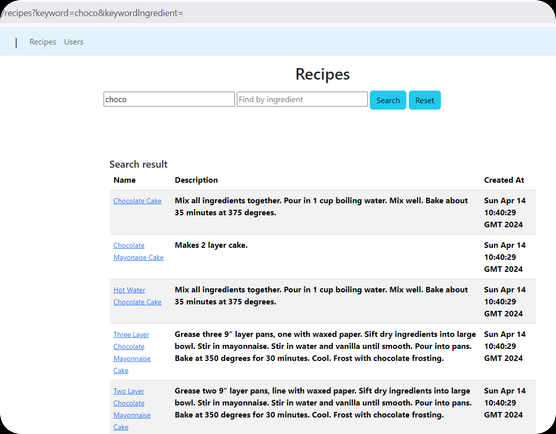
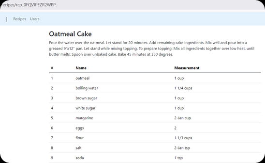

Creating a Dynamic Recipe and Ingredient Search Platform using Spring Boot
===


In today's busy world, making tasty meals at home can be hard. We all want different foods, but looking through cookbooks or lots of recipe websites can take a long time and be annoying. What if there was a better way to find new recipes based on what you already have or what you feel like eating?

This blog dives into the development of a dynamic recipe and ingredient search platform built with Java Spring Boot and a NoSQL database. We'll delve into the specifics of crafting a user-friendly experience that empowers you to discover exciting recipes by title or utilize the ingredients you already have in your pantry.

Get ready to explore the technical aspects of building this powerful search engine for the kitchen. We'll navigate the world of Spring Boot, a robust framework for web applications, and discover the flexibility offered by NoSQL databases in handling recipe data.

### Requirements

We will have the following functional requirements:

1. Import recipes and ingredients from CSV
2. View and search recipes and ingredients

The out of scope:
* User authentication and authorization
* User management (register, login, etc)


## Project Setup

### What you need to install

- [Java 17 or later](https://jdk.java.net/21/), [Maven 3.5+](https://maven.apache.org/download.cgi), [Docker engine](https://docs.docker.com/engine/install/), and your favorite text editor ([Intellij IDEA](https://spring.io/guides/gs/intellij-idea/), or [VSCode](https://spring.io/guides/gs/guides-with-vscode/))

### Create a Spring Boot Project

Spring boot offers a fast way to build applications. 
Spring Boot does not generate code to make edits to your files. Instead, when you start your application, Spring Boot dynamically wires up beans and settings and applies them to your application context.
With Spring Boot, we can focus more on the business features and less on the infrastructure.

Navigate to [start.spring.io](https://start.spring.io/). This service pulls in all the dependencies you need for an application and does most of the setup. Click generate, it will generate the Spring Boot project and download it as a zip. Now unzip this project and import it into any IDE.<br>

To interact with GridDB, we need to add a GridDB Java Client to this project. Add the following dependency into maven `pom.xml`.

```xml
<dependency>
  <groupId>com.github.griddb</groupId>
  <artifactId>gridstore</artifactId>
  <version>5.3.0</version>
</dependency>
<dependency>
  <groupId>com.github.f4b6a3</groupId>
  <artifactId>tsid-creator</artifactId>
  <version>5.2.5</version>
</dependency>
<dependency>
  <groupId>de.siegmar</groupId>
  <artifactId>fastcsv</artifactId>
  <version>3.1.0</version>
</dependency>
```
<p>

## Data Modeling


To support the search features mentioned, we can design a database schema with two main tables: one for storing recipes and another for storing ingredients. Here's a suggested database design:

### ◉ `Recipes Table`
  
This table will store information about each ingredient, including its unique identifier, name, description, and any other relevant details.  
Users can search for recipe by querying this table based on recipe name.


| `Label`         | `Name`         | `Type`                                 | `Nullable` | `Default`           | `Comment`            |
| --------------- | -------------- | -------------------------------------- | ---------- | ------------------- | -------------------- |
| Recipe ID   | id   |  varchar                     | `No`       |                     | System generated unique identifier        |
| Recipe Name | name | varchar                            | `No`       |                     | Recipe Name      |
| Recipe description      | description      | varchar                           | `Yes`       | ''                  | Description, ex: direction |
| Create Time     | createdAt     | datetime                               | `No`       | current_timestamp() | Created Time         |
| Created By       | userId       | varchar                           | `No`       | ''                  | Created By User |
| Recipe Image     | image     | blob | `Yes`       | '' | Blob image         |


### ◉ `Ingredients Table`
  
This table will store information about each recipe, including its unique identifier, name, and measurement.  
Each record in this table will represent a specific ingredient used in a specific recipe.  
Users can search for recipes based on the ingredients they have on hand by querying this table based on ingredient name.


| `Label`         | `Name`         | `Type`                                 | `Nullable` | `Default`           | `Comment`            |
| --------------- | -------------- | -------------------------------------- | ---------- | ------------------- | -------------------- |
| Ingredient ID   | id   |  varchar                     | `No`       |                     | System generated unique identifier        |
| Ingredient Name | name | varchar                            | `No`       |                     | Name      |
| Ingredient measurement      | measurement      | varchar                           | `Yes`       | ''                  | Measurement of the ingredient |
| Create Time     | createdAt     | datetime                               | `No`       | current_timestamp() | Created Time         |
| Recipe Id       | recipeId       | varchar                           | `No`       | ''                  | Belong to a Recipe |

<br>

## Building the Web Application
<p>

### Data access with GridDB

First, we create Java POJO classes that represent the underlying table or container in GridDB.
We annotate a class with Lombok @Data, which automatically generates getters for all fields, a useful toString method, and hashCode and equals implementations that check all non-transient fields. Also generate setters for all non-final fields, as well as a constructor.

We will create the data access class according to the previous database design.
<p>

```java
@Data
public class User {
    @RowKey
    String id;
    String email;
    String fullName;
    Date createdAt;
}

@Data
public class Recipe {
    @RowKey
    String id;
    String name;
    String description;
    Blob image;
    String userId;
    Date createdAt;
}

@Data
public class Ingredient {
    @RowKey
    String id;
    String name;
    String measurement;
    String recipeId;
    Date createdAt;
}
```
<br>

Next, we create the `GridDBConfig` class as a central configuration for database operation.
The class will do the following:
* Read environment variables for connecting to the GridDB database
* Create a GridStore class for managing database connection to the GridDB instance
* Create GridDB Collection's container (Table) to manage a set of rows. The container is a rough equivalent of the table in a relational database.
* On creating/updating the Collection we specify the name and object corresponding to the column layout of the collection.
  Also for each collection, we add an index for a column that is frequently searched and used in the condition of the WHERE section of TQL.

```java
@Configuration
public class GridDBConfig {

  @Value("${GRIDDB_NOTIFICATION_MEMBER}")
  private String notificationMember;

  @Value("${GRIDDB_CLUSTER_NAME}")
  private String clusterName;

  @Value("${GRIDDB_USER}")
  private String user;

  @Value("${GRIDDB_PASSWORD}")
  private String password;

  @Bean
  public GridStore gridStore() throws GSException {
    // Acquiring a GridStore instance
    Properties properties = new Properties();
    properties.setProperty("notificationMember", notificationMember);
    properties.setProperty("clusterName", clusterName);
    properties.setProperty("user", user);
    properties.setProperty("password", password);
    GridStore store = GridStoreFactory.getInstance().getGridStore(properties);
    return store;
  }

  @Bean
    public Collection<String, User> userCollection(GridStore gridStore) throws GSException {
        Collection<String, User> collection = gridStore.putCollection("users", User.class);
        collection.createIndex("email");
        return collection;
    }

    @Bean
    public Collection<String, Recipe> recipeCollection(GridStore gridStore) throws GSException {
        gridStore.dropCollection(AppConstant.RECIPES_CONTAINER);
        Collection<String, Recipe> collection = gridStore.putCollection(AppConstant.RECIPES_CONTAINER, Recipe.class);
        collection.createIndex("name");
        return collection;
    }

    @Bean
    public Collection<String, Ingredient> ingredientCollection(GridStore gridStore) throws GSException {
        gridStore.dropCollection(AppConstant.INGREDIENTS_CONTAINER);
        Collection<String, Ingredient> collection =
                gridStore.putCollection(AppConstant.INGREDIENTS_CONTAINER, Ingredient.class);
        collection.createIndex("name");
        return collection;
    }
}
```
<br>

### Seed recipes from CSV

Here is the CSV format we want to import:

|Title            |Directions|Quantity1|Unit1 |Ingredient1      |Quantity2|Unit2|Ingredient2|Quantity3|Unit3|Ingredient3  |Quantity4|Unit4|Ingredient4|
|-----------------|----------|---------|------|-----------------|---------|-----|-----------|---------|-----|-------------|---------|-----|-----------|
|Baked Green Beans|          |1        |pound |fresh green beans|2-Jan    |cup  |water      |1        |tsp  |onion, minced|         |     |           |
|Egg Roll Filling |          |16       |ounces|shrimp           |3        |tbsp |oil        |2        |cups |diced celery |         |     |           |

<br>

#### Extract ingredients
<p>

```java
for (final NamedCsvRecord csvRecord : namedCsv) {
  List<CreateIngredientRequest> ingredients = new ArrayList<>(19);
  for (int idxOfIngredient = 1; idxOfIngredient <= 19; idxOfIngredient++) {
      if (csvRecord.getField("Quantity" + idxOfIngredient).isBlank()) {
          break;
      }
      String quantityStr = csvRecord.getField("Quantity" + idxOfIngredient);
      String unitOfMeasure = csvRecord.getField("Unit" + idxOfIngredient);
      String ingredientName = csvRecord.getField("Ingredient" + idxOfIngredient);
      ingredients.add(CreateIngredientRequest.builder()
              .name(ingredientName)
              .measurement(quantityStr + " " + unitOfMeasure)
              .build());
  }
}
```

This code snippet creates a list of CreateIngredientRequest objects called ingredients. It iterates over a range of numbers from 1 to 19 and checks if a specific field in the csvRecord object is blank. If it is not blank, it extracts the quantity, unit of measure, and ingredient name from the csvRecord object and adds a new CreateIngredientRequest object to the ingredients list.
<br>

#### Extract & Save Recipe
<p>

```java
for (final NamedCsvRecord csvRecord : namedCsv) {
  List<String> fields = csvRecord.getFields();
  String recipeName = fields.get(0);
  String recipeDesc = fields.get(1);
  try {
      User user = userService.getRandomUser();
      recipeService.createWithIngredients(
              user,
              CreateRecipeRequest.builder()
                      .name(recipeName)
                      .description(recipeDesc)
                      .build(),
              ingredients);
  } catch (GSException e) {
      log.info("Recipe: {} = {}", recipeName, recipeDesc);
      ingredients.forEach(ingredient -> {
          log.info("{}", ingredient);
      });
      e.printStackTrace();
  }
}
```

Here's a breakdown of what it does:

  1. It retrieves the fields from the current CSV record using csvRecord.getFields().
  2. It assigns the first field to recipeName and the second field to recipeDesc.
  3. It calls userService.getRandomUser() to get a random user.
  4. It creates a new CreateRecipeRequest using the recipeName and recipeDesc.
  5. It calls recipeService.createWithIngredients() to create a recipe with the given user, request, and ingredients.
  6. This code assumes that csvRecord, userService, recipeService, and ingredients are properly initialized and accessible in the surrounding code.
<br>

### Search recipe's code

<p>

#### Search recipe UI

```html
<div class="my-3">
    <h2 class="text-center">Recipes</h2>
    </p>
    <form method="get" th:action="@{/recipes}">
        <input name="keyword" placeholder="Find by recipe name" size="30" th:value="${keyword}" type="text">
        <input name="keywordIngredient" placeholder="Find by ingredient" size="30" th:value="${keywordIngredient}" type="text">
        <button class="btn btn-info" type="submit">Search</button>
        <a th:href="@{/recipes}" class="btn btn-info">Reset</a>
    </form>
</div>
```

This bit of HTML code shows a form with two places to type things and two buttons.
The form uses the `get` method and goes to `/recipes` when it's sent. When you click the button, it sends a message to the `/recipes` place asking for information.  
In the first box, you can type a keyword like a recipe name. It's got a space to type in, and what you type is connected to the `${keyword}` thing. So, if you type something, it'll look for that thing.  
The second box is for ingredients. You can type in an ingredient, and it's connected to the `${keywordIngredient}` thing.
The first button is a `submit` button. When you click it, it sends the form.

<p>

```html
<div th:if="${recipes.size() > 0}" class="container">
    <h5 class="m-0 font-weight-bold">Search result</h6>
    <table class="table table-hover table-responsive-xl table-striped">
        <thead class="thead-light">
            <tr>
                <th scope="col">Name</th>
                <th scope="col">Description</th>
                <th scope="col">Created At</th>
            </tr>
        </thead>
        <tbody class="table-group-divider">
            <tr th:each="recipe : ${recipes}">
                <td>
                    <a class="small" th:href="@{/recipes/{id}(id=${recipe.id})}" th:text="${recipe.name}"></a>
                </td>
                <th scope="row">[[${recipe.description}]]</th>
                <th id="createdAt" scope="row">[[${recipe.createdAt}]]</th>
            </tr>
        </tbody>
    </table>
</div>
```

This piece of code is like a pattern for showing recipe search results on a webpage. First, it checks if there are any recipes to show. If there are, it arranges them nicely in a table. Each row in the table tells you the name of the recipe, what it's about, and when it was made. The `th:each` part goes through the list of recipes and shows each recipe's info in a row.

<p>

#### Search recipe's Web Controller

```java
@Controller
@RequestMapping("/recipes")
@RequiredArgsConstructor
public class RecipesController {
  private final RecipeService recipeService;

  @GetMapping
  String recipes(Model model, String keyword, String keywordIngredient) {
      List<Recipe> recipes = recipeService.fetchAll(keyword, keywordIngredient);
      model.addAttribute("recipes", recipes);
      if (keywordIngredient != null && !keywordIngredient.isBlank()) {
          model.addAttribute("keywordIngredient", keywordIngredient);
      } else {
          model.addAttribute("keyword", keyword);
      }
      return "recipes";
  }
}

```

`RecipesController` will receive data submitted by the search form. Then fetches all recipes from the database, optionally filtering by keyword and/or keywordIngredient.

<p>

#### Search recipe's Service Layer

```java
public List<Recipe> fetchAll(String searchRecipe, String searchIngredient) {
        List<Recipe> recipes = new ArrayList<>(0);
        try {
            if (searchIngredient != null && !searchIngredient.isBlank()) {
                log.info("Search by ingredient: {}", searchIngredient.toLowerCase());
                Query<Ingredient> queryIngredient = ingredientCollection.query(
                        "SELECT * FROM " + AppConstant.INGREDIENTS_CONTAINER + " WHERE LOWER(name) LIKE '%"
                                + searchIngredient.toLowerCase() + "%'",
                        Ingredient.class);
                RowSet<Ingredient> rowIngredientSet = queryIngredient.fetch();
                while (rowIngredientSet.hasNext()) {
                    Recipe recipe = fetchOne(rowIngredientSet.next().getRecipeId());
                    if (recipe != null) {
                        recipes.add(recipe);
                    }
                }
                return recipes;
            }

            String tql = "SELECT * ";
            if (searchRecipe != null && !searchRecipe.isBlank()) {
                log.info("Search by recipe:{}", searchRecipe.toLowerCase());
                tql = "SELECT * FROM " + AppConstant.RECIPES_CONTAINER + " WHERE LOWER(name) LIKE '%"
                        + searchRecipe.toLowerCase() + "%'";
            }

            Query<Recipe> query = recipeCollection.query(tql, Recipe.class);
            RowSet<Recipe> rowSet = query.fetch();
            while (rowSet.hasNext()) {
                recipes.add(rowSet.next());
            }
        } catch (GSException e) {
            log.error("Error search recipes", e);
        }
        return recipes;
    }
```

This piece of code defines a function called fetchAll. This function takes two things as input: searchRecipe and searchIngredient, both of which are just text (strings).
First, it checks if you provided anything in the searchIngredient part. If you did, it searches for ingredients that match what you typed in that field (ignoring case, so "apple" and "Apple" would be the same). It then looks for recipes that use those ingredients and adds them to a list.
If you didn't provide anything for searchIngredient, it checks the searchRecipe part instead. Here, it searches for recipes that match what you typed in the recipe name field (again, ignoring the case). Any recipes it finds are added to the list.
If anything goes wrong while searching, the function writes a message about the error.
In the end, the function returns the list of recipes it found (it might be empty if nothing matches your search).

### Running the Project with Docker Compose

To spin up the project we will utilize Docker, a popular container engine.
Build the docker image using the following command:
```bash
  docker compose -f docker-compose-dev.yml build
```

Run the app:
```bash
  docker compose -f docker-compose-dev.yml up
```

The website ready at http://localhost:8080




## Conclusion

In this blog post, we've explored the steps to create a dynamic recipe search platform. We saw how Spring Boot, a powerful framework for web applications, and GridDB, a flexible NoSQL database, can join forces to create a user-friendly search experience.  
This is just the beginning, and you can extend this platform further. You could add features like user accounts, recipe ratings and reviews, or even integrate with external APIs to display nutritional information or recipe images.  
The entire code for the web application is available on [Github](https://github.com/alifruliarso?tab=repositories).
